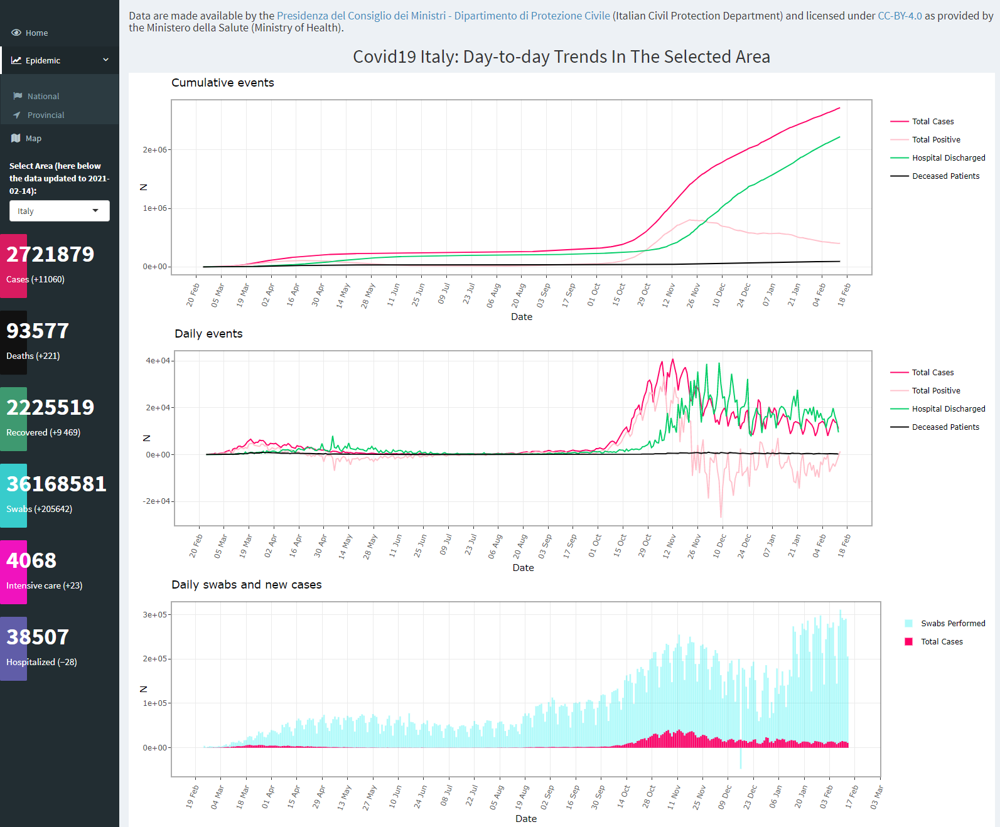

<!-- README.md is generated from README.Rmd. Please edit that file -->

# covid19ita

This github page contains the code and input data for the
[covid19ita](https://sgeremia.shinyapps.io/covid19ita/) Shiny App.  
The app allows the monitoring of the spread of Covid-19 infection in
Italy.

A screenshot of the interface is provided below.

## Data

You can find R versions of the three [official Italian COVID-19
datasets](https://github.com/pcm-dpc/COVID-19/) at national, regional
and provincial level of detail.

**Last data update**: 2021-02-14.

## Data attribution

**License**:
[CC-BY-4.0](https://creativecommons.org/licenses/by/4.0/deed.en) - [View
license](https://github.com/pcm-dpc/COVID-19/blob/master/LICENSE)

**Dataset author/editor**: [Dipartimento della Protezione
Civile](http://www.protezionecivile.it/)

**Data provided by**: [Ministero della
Salute](http://www.salute.gov.it/)

**Original data processing and management by**: [Dipartimento della
Protezione Civile](http://www.protezionecivile.it/)
